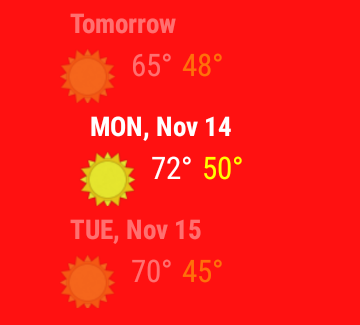
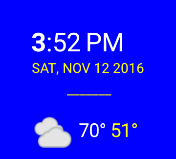
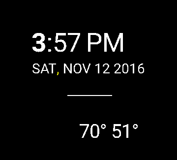
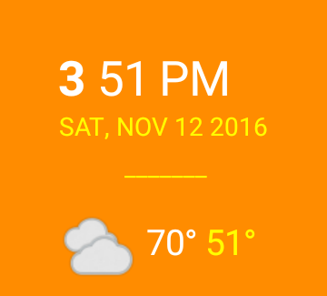
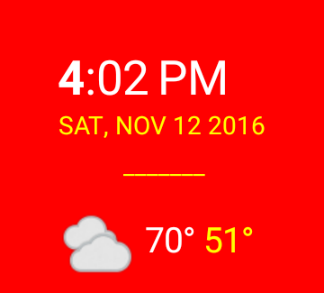
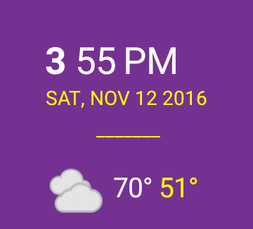
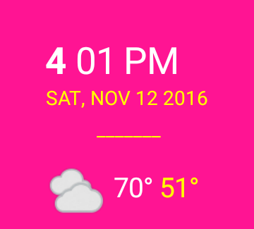

# Go Ubiquitous
Android Developer NanoDegree Project 6

## Objectives
- App works on both round and square face watches.
- App displays the current time.
- App displays the high and low temperatures.
- App displays a graphic that summarizes the day’s weather (e.g., a sunny image, rainy image, cloudy image, etc.).
- App has an activity to display 2 weeks worth of weather data.
- App has a configuration activity to change background color of watch face.
- App configuration activity allows you to toggle on and of  military time.

## Installation
Download the zip file and extract the contents. From Android Studio, File - New - Import Project. Then navigate to the top level of the Go_Ubiquitous project and click Ok.An API Key needs to be downloaded from this link: [https://home.openweathermap.org/users/sign_up] (https://home/openweathermap.org/users/signup)

Install the key in the project gradle.properties file. The key entry is as follows:

`MyOpenWeatherMapApiKey="api key here"`

Follow normal procedures to install the mobil and wear versions of the app.

## Images

License
-------
Copyright 2015 The Android Open Source Project, Inc.

Licensed to the Apache Software Foundation (ASF) under one or more contributor
license agreements.  See the NOTICE file distributed with this work for
additional information regarding copyright ownership.  The ASF licenses this
file to you under the Apache License, Version 2.0 (the "License"); you may not
use this file except in compliance with the License.  You may obtain a copy of
the License at

http://www.apache.org/licenses/LICENSE-2.0

Unless required by applicable law or agreed to in writing, software
distributed under the License is distributed on an "AS IS" BASIS, WITHOUT
WARRANTIES OR CONDITIONS OF ANY KIND, either express or implied.  See the
License for the specific language governing permissions and limitations under
the License.

